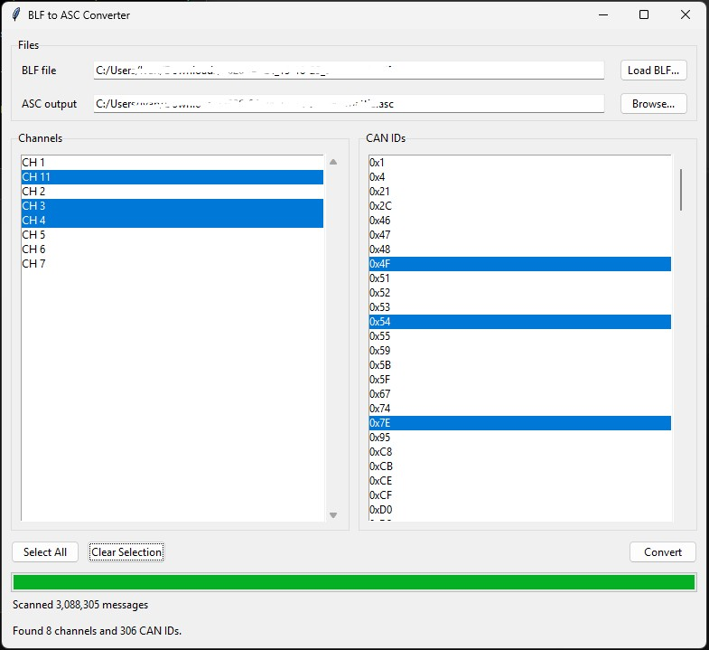

# Convert .blf files into .asc

This simple script converts `.blf` (CANalyzer/CANoe) files into `.asc` (ASCII).

## Installation

```$ pip install requirements.txt```

## GUI

Start the graphical converter with:

```$ python blf2asc_gui.py```

Load a BLF file, select the channels and CAN IDs you want to include, then click `Convert`.
The GUI shows progress while scanning and converting.



## CLI

Convert a BLF file from the command line with:

```$ python blf2asc.py -i "inputfile.blf" -o "outputfile.asc"```

To include only messages with specific CAN IDs, pass a comma-separated list with `-c` or `--can-id`:

```$ python blf2asc.py -i "inputfile.blf" -o "outputfile.asc" -c 123,0x456```

CAN IDs are interpreted as hexadecimal values. Both `123` and `0x123` match CAN ID `0x123`.

Output timestamps are relative to the first written message and use `mm:ss.nnnnnn` format.
Each output line starts with the timestamp and channel, for example `00:00.000000 CH 1  18DA41F1 ...`.

## Help

This command will show an help on how to use the script

```$ python blf2asc.py -h```
